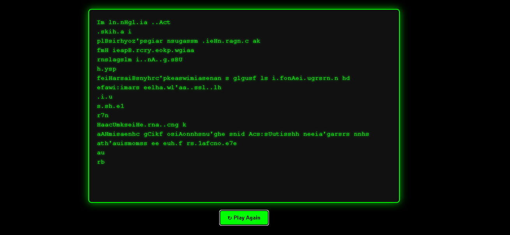

# 🧑‍💻 Hackerman Terminal Simulation

A fun and animated terminal-style web app built with **React.js**, simulating a fake "hacker" interface with typewriter effect, animations, and interactivity.

> ✅ Built for learning React, DOM manipulation, and user interaction.

---

## 🚀 Features

- 🖥️ Terminal-style UI with green-on-black theme
- ⌨️ Typewriter animation with randomized speed
- 🔁 Replay button to restart the animation
- 📱 Fully responsive design
- ⚛️ Powered by React.js

---

## 🛠️ Tech Stack

- **Frontend:** React.js, CSS (no external libraries)
- **Styling:** Pure CSS (custom terminal theme)
- **Deployment:** GitHub Pages (optional)

---

## 📸 Demo

[🔗 Live Demo](https://abhi2214.github.io/Hacker-Man/)  
📷
